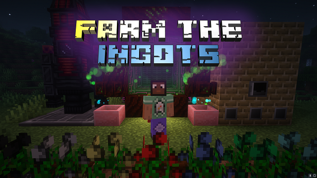

# Farm The Ingots

A 1.20.1-fabric modpack focusing on Tech & Farming.

This is a fabric modpack on Minecraft 1.20.1, focusing on Tech and Farming.

In this modpack, you can literally plant every minerals from all kinds of magic seeds.
With farming, you could build grand multi-block machines, explore all the danger, and even go to the space!

This modpack contains full guidance (including issue resolver) in the FTB quest book, so you really need to read that book very often.

# Client installation

You are suggested to use [Hello! Minecraft Launcher 3](https://github.com/HMCL-dev/HMCL/releases).

1. Download the latest version of the modpack zip.
2. Drag the zip file into HMCL.
3. To optimize threading, you may change settings `Settings->Video Settings->Performance->Thread`. Half of the maximum is recommended.

# Server installation

1. Download `Farm.The.Ingots-server.zip` from [release](https://github.com/MUYUTwilighter/Farm-The-Ingots/releases/latest/download/Farm.The.Ingots-server.zip)
2. Unzip the file to a prepared directory, you may not change it later.
3. There is an integrated `server.properties`, if you want to change some properties, do it here.
4. Run `start.bat`. If your default java is not java 17 (or higher), specify `java_path` by edit this file.
5. An `eula.txt` file generated on the first launch, change `eula=false` to `enla=true` to show agreement to the End-user License Agreement from Mojang.
6. Rerun `start.bat`.

# FTI Essential Features

FTI Essential Features is a mod dedicatedly built for this modpack *(That's why it's not published)* to implement some necessary features.

To avoid confusions, I assume it's vital to introduce this mod.

## Features

- Preventing players from entering Glacio dimension `ad_astra:glacio` from Ad Astra when they are not **fully** equipped with Jet Suit
- Add custom music to Glacio dimension `ad_astra:glacio` from Ad Astra
- Add options to configure max ench-level of Tool Leveling Rework
- Add options to toggle visibility of flowing items in pipes from Modern Dynamic (Greatly enhance frame rate when not visible)
- Add options to completely disable the visibility of item rendering in drawer blocks from Extended Drawers.

# Other Features

1. Full resource pack feature is supported. Find and download resource packs [here](https://www.curseforge.com/minecraft/search?page=1&pageSize=20&sortBy=relevancy&class=texture-packs) or [here](https://modrinth.com/resourcepacks), then put the downloaded files into `<GameDir>/resourcepacks`.
2. Shaders are supported by default but you need to download shaderpacks from [here](https://modrinth.com/shaders) and [here](https://www.curseforge.com/minecraft/search?page=1&pageSize=20&sortBy=relevancy&class=shaders), then put the downloaded files into `<GameDir>/shaderpacks`.
3. This modpack integrates with [Yes Steve Model](https://modrinth.com/mod/yes-steve-model), which allows you to modify the player model.

# License

**DO NOT DISTRIBUTE ANY FILE WITHOUT PERMISSION**

This repo might directly contain the file of some other projects due to unopen configurations by CurseForge (I hate that, really), so if any author of the projects do not want their files exposed here, please let me know!!!

This repo is not published for profit, so please do not report for issues mentioned above! We can negotiate it!!